**Speed.ORM - Born to be fast**

**Download do programa Speed (ClickOnce):**
<https://github.com/carlosast/Speed-ORM/raw/master/publish/setup.exe>

Como usar
=========

Se não deseja perder tempo e ter classes para acessar toda sua base de dados em
poucos minutos clique no link abaixo para ter uma introdução rápida do uso:

<https://github.com/carlosast/Speed-ORM/blob/master/resumo.md>

Introdução
==========

Speed.ORM foi desenvolvido com 3 pré-requisitos:

1.  Ser o mais rápido ORM no mundo .NET;

2.  Produtividade: gerar todo o código Sql, liberando o desenvolvedor para se
    focar no que interessa;

3.  Em alguns minutos, gera a camada de dados e a de negócios, automatizando 90%
    deste processo. Caberá ao desenvolvedor escrever alguns métodos na camada de
    negócios.

Não tem objetivo de ter todos recursos que alguns frameworks têm, tal como o
Entity Framework ou NHibernate, mas tem o objetivo de ser muito mais rápido e
usar muito menos memória

1 - História
============

Trabalho como especialista em performance de aplicações e bancos de dados há
mais de 15 anos. Através das análises, detectei que um dos problemas era como
framework de ORM que estava sendo usado ou mesmo como foram desenvolvidas as
camadas de dados e de negócios, usando procedures e ADO.NET.

Usando o Entity Framework como ORM, tente fazer um loop para inserir 10000000 de
registros: ele usa vários gigabytes de memória, e se o computador não tiver
memória pra isso, vai travar. Além disso, apesar do Entity Framework possuir
vários recursos interessantes, tal como o LINQ TO SQL, não é adequado para um
sistema que precise ser rápido e escalável. O mesmo vale pra o NHibernate

Por outro lado, há os puristas, que acreditam que todo o sistema, inclusive as
rotinas de CRUD, devam ser feitos com procedures. Que têm o discurso que é mais
rápido, e é assim que tem que ser feito. Não sou contra o uso de Stored
Procedures, mas sim no seu uso apenas quando é necessário. Por exemplo, tem
sentido trazer um volume enorme do banco de dados para o ORM para aplicar um
aumento de preços de 10% para 100000 produtos. Neste caso deve-se usar
procedure. Mas para fazer o CRUD básico isso não é necessário, devido os
seguintes fatores:

-   **Custo**: contabilize quantas horas são gastas para fazer as rotinas e
    procedures de CRUD pra uma banco de dados médio, de 300 tabelas por exemplo?
    Considerando que se gaste 15 minutos para fazer cada procedure de Insert,
    Select, Update e Delete, mais 15 minutos para a classe de DTO e mais 60
    minutos para a classe de business.

-   **Manutenção**: é muito comum, num desenvolvimento diário, o caso de se
    colocar uma coluna nova numa tabela. O desenvolvedor, devido ao prazo curto,
    acaba colocando na procedure de “Insert”, e não coloca na procedure de
    “Update”. Entre muitos outros casos que acontecem

-   **Lógica**: Vamos supor que, para salvar um registro na tabela de Customers,
    usando procedure demore 10ms, enquanto que usando ORM demore 12ms. Isto
    causa algum impacto na performance do sistema? O purista dirá que sim, mas
    se perguntar para quem vai pagar pelo software (que geralmente não sabe
    disso), com certeza responderá que não

-   **Portanto, sou a favor da seguinte filosofia:**

-   **A ORM o que é de ORM e a Procedure o que é de Procedure**

Espero que esta biblioteca possa ser útil à comunidade.

3 - Bancos de dados suportados:
===============================

-   Sql Server

-   Oracle

-   PostgreSQL

-   MySql

-   Firebird

-   SqlServerCe

Caso haja necessidade suportar outros bancos de dados, não demora mais que
algumas horas para fazer esta implementação

4 - Estrutura do Speed
======================

A biblioteca Speed é composta de 1 DLL principal "Speed.Data":

-   **Namespace Speed.Common** – Classes úteis. Por exemplo:

-   CollectionUtil: Classe que alguns métodos adicionais a IEnumerable e
    Dictionary

-   Conv: a classe mais usada em Speed. Possui métodos de conversões

-   Cryptography: Criptografia

-   DataTimer\<T\>: É uma classe de um cache simples, em memória. Um seu
    constructor se define uma function que carregará os valores, e um Timeout.
    Assim, pode ler o valor da propriedade Value. Se estourou o Timeout,
    DataTimer recarrega os valores, senão retorna o valor da memória

-   CloneCompiler: Gera uma proxy compilado em memória para fazer clone de
    classes (properties e fields). Milhares de vezes mais rápido que reflection

-   ETC

-   **Namespace Speed. Data** – Classes de manipulação de dados e metadados para
    vários bancos de dados

-   A classe principal do Speed.Data é a Database, que encapsula uma connection
    para o banco de dados selecionado, e possui também vários métodos úteis de
    acesso de dados. Ex: ExecutaDataTable, ExecuteScalar, ExecuteInt32, etc.

-   A classe Database possui uma propriedade chamada “Provider”, que possui
    métodos de extração de metadados específico para cada banco de dados

5 - Programa Speed
==================

Programa que permite a configuração e geração de códigos de base de dados.

O programa permite a configuração (banco de dados a usar, diretórios) e a
seleção das tabelas e views à serem geradas as classes. A parte de geração de
códigos pra Stored Procedures será liberada em breve

É composto de 2 abas:

5.1 - Aba “Configuration”
-------------------------

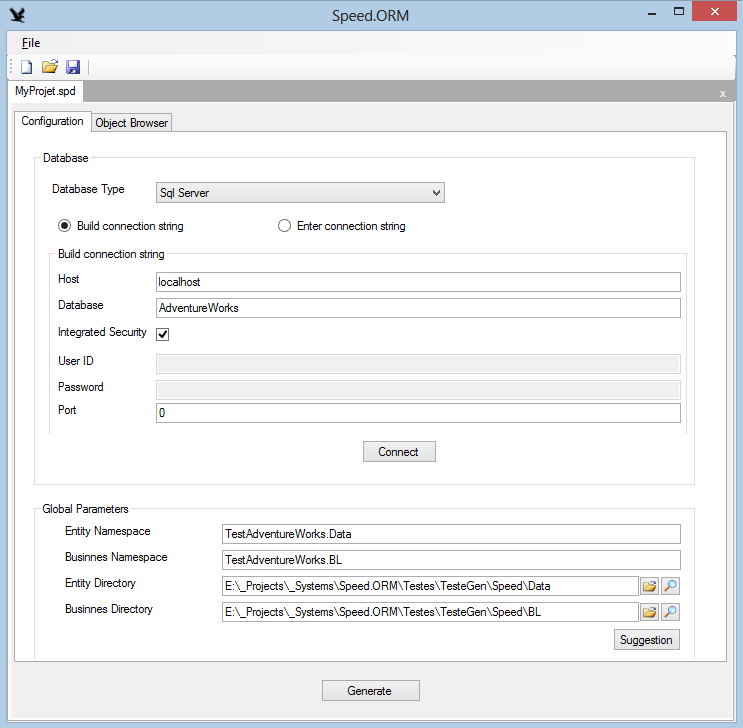

-   **Database Type**: Selecione o tipo de banco de dados: Firebird, MySql,
    Oracle, PostgreSql e Sql Server. Speed suporta também SqlServerCE, mas ainda
    precisa de mais testes

-   **Build Connection String**: se gera a Connection String através dos valores
    de Server, Database, Integrated Security, User ID e Password

-   **Enter Connection String**: permite que se entre o valor da connection
    string

-   **Host:** Server. Ex: localhost

-   **Database:** database name

-   **Integrated Security:** se usa segurança integrada. Neste caso não serão
    entrados valores de User ID e Password

-   **User ID:** nome do usuário do banco de dados

-   **Password:** senha

-   **Port:** porta do banco de dados. Deixe 0, para ser usada a porta padrão

Global Parameters:

-   **Entity Namespace**: namespace das classes de dados

-   **Business Namespace**: namespace das classes de negócios

-   **Entity Directory**: diretórios onde serão gravas as classes de dados

-   **Business Directory**: diretórios onde serão gravas as classes de negócios

-   **Suggestion:** botão que permite selecionar o arquivo de solution (.sln),
    que serão sugeridos valores para os parâmetros acima. Isto não é
    obrigatório. O desenvolvedor pode colocas os valores que desejar nos
    parâmetros

5.2 - Aba “Object Browser”
--------------------------

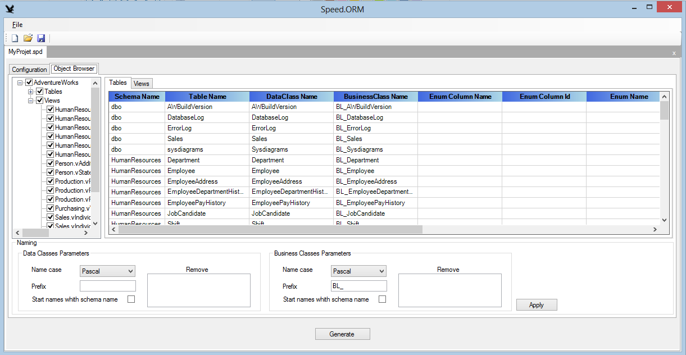

Do lado esquerdo, permite selecionar os objetos do banco de dados que serão
geradas as classes. Somente serão gerados códigos pra os objetos selecionados no
treeview

Do lado direito aparecem “Tables” e “Views”. Para cada linha, temos as seguintes
colunas:

-   **Schema name**: Nome do schema no banco de dados. Não pode ser alterado

-   **Table name**: Nome da table/view no banco de dados. Não pode ser alterado

-   **Data Class Name**: nome da classe de dados correspondente à table/view

-   **Business Class Name**: nome da classe negócios correspondente à table/view

-   **Enum column name**: às vezes, precisamos gerar um enum dos dados de uma
    tabela. Column name corresponde à coluna que possui os valores de texto do
    enum

-   **Enum column Id**: coluna que possui os valores numéricos do enum

-   **Enum name**: nome da classe do enum

-   **Naming**: Groupbox com funções que facilitam a geração de nomes para
    classes. Não é obrigatório seu uso. É apenas um facilitador. Se desejar, o
    desenvolvedor pode digitar os nomes das classes e enums.

    -   **Name case**: o tipo de case usado para gerar os nomes de classes e
        enums:

        -   **Original name**: usado o mesmo valor que vem do banco de dados

        -   **Camel:** notação camel. Quando os valores possuírem ‘_’, este será
            removido

        -   **Pascal:** notação pascal. Quando os valores possuírem ‘_’, este
            será removido

        -   **Lowercase**: todas as letras serão convertidas para minúsculas

        -   **Uppercase**: todas as letras serão convertidas para maiúsculas

    -   **Prefix:** um prefixo que serão colocado antes do nome da classes

    -   **Start names with schema**: se coloca o Schema Name antes do nome da
        classes. Porém este virá depois de “Prefix”

    -   **Remove:** lista de valores que serão removidos dos nomes, separados
        por ‘;’. Pode conter espaços para ficar com uma formatação melhor, que
        estes caracteres não serão considerados

| **Importante**: Para cada objeto (table / view) serão gerados 4 arquivos separados. Ex: considere uma table chamada Customer. Considere que a Data class chama-se “Customer” e Business class chama-se “Customers”. Serão gerados os seguintes arquivos: |
|----------------------------------------------------------------------------------------------------------------------------------------------------------------------------------------------------------------------------------------------------------|

-   Entity

    -   **Customer.cs** – classe de dados que possui as propriedades com os
        nomes das colunas da table ou view do banco. Quando houver alguma
        alteração no objeto, na próxima vez que for gerada, essa classe será
        sobreposta. Portanto, qualquer alteração manual feita nessa classe será
        perdida

    -   **Customer_Ext.cs** – classe de extensão de customer. Usa o atributo
        “partial”. Coloque aqui propriedades adicionais se desejar. Este arquivo
        será gerado apenas 1 vez, e jamais será sobreposto. Todas as alterações
        feitas aqui serão preservadas

-   Business

    -   **Customers.cs** – classe de negócios que possui as propriedades com os
        nomes das colunas da table ou view do banco. Quando houver alguma
        alteração no objeto, na próxima vez que for gerada, essa classe será
        sobreposta. Portanto, qualquer alteração manual feita nessa classe será
        perdida

    -   Customers_Ext**.cs** – classe de extensão de customers. Usa o atributo
        “partial”. Coloque aqui os métodos se desejar. Este arquivo serão gerado
        apenas 1 vez, e jamais será sobreposto. Todas as alterações feitas aqui
        serão preservadas

5.3 - Exemplo de uso
====================

Descreverei, em detalhes, como usar o **Speed** para um projeto novo. Considere
um projeto chamado **MyProject**. Neste exemplo será um Windows Forms, mas pode
ser um projeto web, console ou qualquer outro projeto. Os diretórios e nomes
usados aqui são apenas para exemplo. O desenvolvedor pode usar os valores que
desejar

-   Crie o diretório “**C:\\Projects**”. Eu costumo colocar todos meus projetos
    dentre de um diretório padrão, chamado “Projects”. E MyProject será mais uma
    solução dentro deste

-   Considere que o banco de dados, também chamado **MyProjet**, possui as
    seguintes tabelas

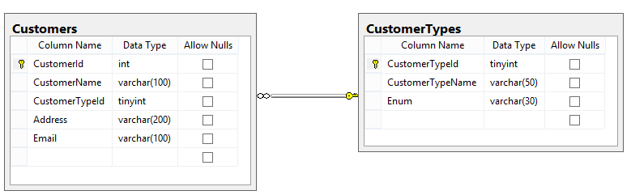

-   No Visual Studio

    -   selecione “New Project”

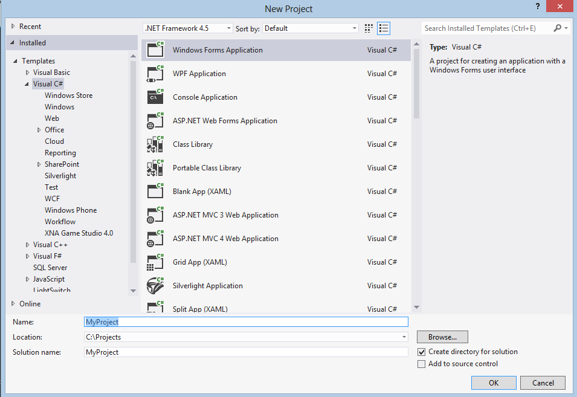

-   A solution será criada em “C:\\Projects\\MyProject\\MyProject.sln”

    -   Em File/ Add / New Project

        -   Selecione um projeto do tipo “Class Library”, e chame-o de
            “MyProject.Data”.  
            Este será o projeto de dados

            -   Delete Class1.cs

    -   Em File/ Add / New Project

        -   Selecione um projeto do tipo “Class Library”, e chame-o de
            “MyProject.BL” Este será o projeto de negócios

            -   Delete Class1.cs

    -   No projeto “MyProject.BL”, some uma referência a “MyProject.Data”

    -   No projeto “MyProject”, some referências a “MyProject.Data” e
        “MyProject.BL”

-   Execute o aplicativo Speed e clique no botão “New”

    -   Print das telas com as configurações que vou detalhar abaixo:

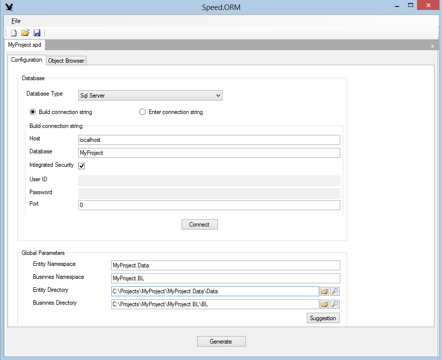

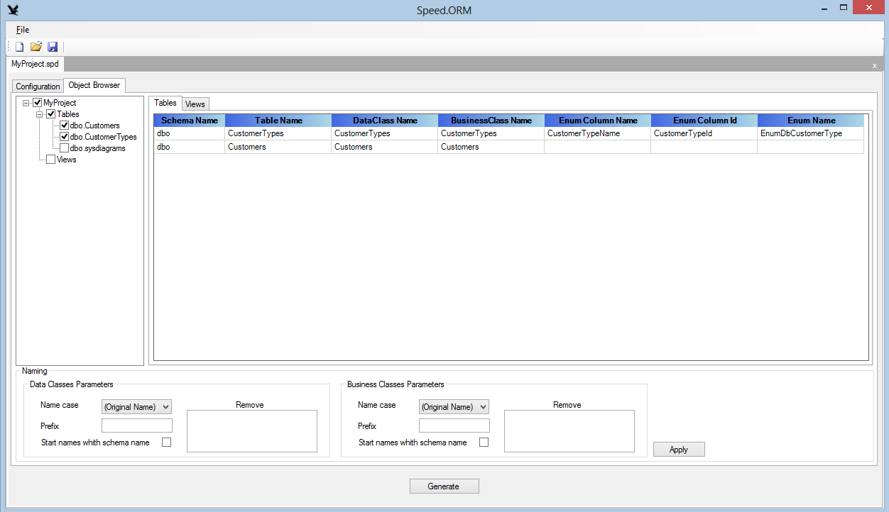

-   **Aba “Configuration”**

    -   **Server type**: Sql Server

        -   **Build Connection string**: marque

            -   **Host:** localhost. Nesse caso está na máquina local, mas pode
                ser qualquer servidor remoto, até num provedor

            -   **Database**: MyProject

            -   **“Integrated Security”**: marque. Pode-se usar também User ID e
                Password se desejar

            -   **Clique no botão “Connect” pra checar se está correta a conexão
                com o banco de dados**

        -   **Global Parameters:**

            -   **Entity Namespace**: MyProject.Data  
                **Business Namespace**: MyProject.BL  
                **Entity Directory**:
                **“C:\\Projects\\MyProject\\MyProject.Data\\Data”**. Repare que
                uso o subdiretório Data. Assim, todas as classes geradas ficarão
                dentro deste subdiretório, e não se misturarão com outras
                classes que você possa adicionar depois no projeto

            -   **Business Directory**:
                **“C:\\Projects\\MyProject\\MyProject.BL”**. Repare que uso o
                subdiretório “BL”. Assim, todas as classes geradas ficarão
                dentro deste subdiretório, e não se misturarão com outras
                classes que você possa adicionar depois no projeto

    -   **Aba “Object Browser”**

        -   Nesse caso, não vou fazer grandes mudanças nos nomes. Selecione
            todos os objetos que desejar e clique no notão “Apply”, que serão
            gerados os nomes de “Data class” e “Business class”.  
            No de caso de “Data Class”, os nomes gerados foram no plural, tal
            como estão nas tabelas. Eu prefiro nome de Entity no singular. Assim
            altero manualmente esses valores. Não aplique novamente “Apply”,
            senão esses valores serão alterados. No caso de se ter novos
            objetos, selecione apenas o novos objetos para aplicar “Apply”,
            assim serão mantidos os valores dos demais, porque “Apply” é
            aplicado apenas nos objetos selecionados no treeview.

        -   **CustomerTypes é uma tabela que é interessante gerar um enum** de
            seus valores. Isto permitirá que façamos comparações em código
            usando o Enum ao invés de valores numéricos. Para isso, criei em
            CustomerTypes uma coluna chamada **“Enum”** (poderia ter outro
            nome). Chamei o “Enum Name” de EnumDbCustomerType. Costumo usar
            EnumDb pra indicar que é um Enum e que é originários da base de
            dados. Colocando Enum antes também facilita o auto complete.

        -   **Está tudo pronto**. Agora clique no botão **“Generate”**, e sua
            camada de dados e de negócios estará pronta.  
            Repare que o Speed apenas gera os arquivos. Caberá ao desenvolvedor
            adicioná-los nos projetos.

    -   **“Visual Studio”**

        -   **Como adiciono as classes geradas pelo Speed no meu projeto?**  
            No Visual Studio, para os projetos “MyProject.Data” e
            “MyProject.BL”, vá no “Solution Explorer” e clique no botão “Show
            All Files”, que aparecerão pastas e arquivos que não fazem parte da
            solution, como mostrado na figura abaixo

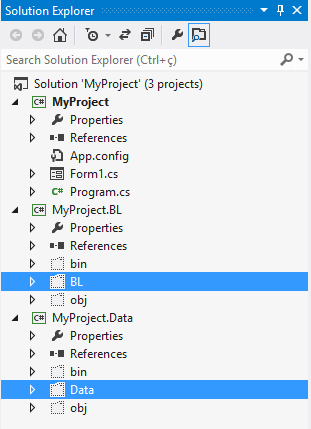

-   Clique com o botão direito do mouse sobre a pasta “Data” e selecione
    “Include in Project”. Repita este procedimento para a pasta “BL”.
    Posteriormente, quando se gerar código para novos objetos, o desenvolvedor
    terá que fazer o include para os 4 arquivos individuais para cada objeto.

    -   Estou planejando fazer um **Add-in**, para automatizar todo este
        processo no Visual Studio. É por isto que, na Solution Speed, coloquei
        as telas do projeto Speed numa DLL separada (Speed.UI), porque vou
        compartilhá-la com o projeto de Add-in

        -   Passos finais:

            -   Como este projeto usa o Sql Server, adicione o nuget
                Speed.ORM.SqlServer aos projetos 3 projetos

            -   No projeto “MyProject.Data” some as seguintes referências:

                -   Speed.Common

                -   Speed.Data

                -   System.Runtime.Serialization. Esta DLL é necessária, porque
                    as “Data classes” usam os atributos “DataMember”, para
                    serialização em Web Services ou WCF

            -   No projeto “MyProject.BL” some as seguintes referências:

                -   MyProject.Data

            -   No projeto “MyProject” some as seguintes referências:

                -   MyProject.Data

                -   MyProject.BL

    -   **Programando**

        -   **Aqui descreverei como se usar uma simples tela de cadastro usando
            o os projetos zerados pelo Speed**

-   Os projetos ficaram com a seguinte estrutura:

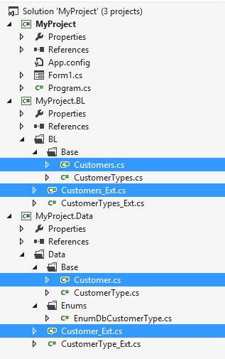

-   Repare que a table “Customer” possui 4 arquivos. Os arquivos com “_Ext”
    serão os arquivos que você poderá colocar propriedades ou métodos
    adicionais. Os arquivos sem “_Ext”, serão sobrepostos, sempre que o objeto
    for alterado na base dados e se usar a aplicação Speed para gerar novamente
    o código.

-   Classe **MyProject.Data\\Data\\Customer\\Base\\Customer.cs**  
    Classe base de Customer. Repare no atributo “partial” na class

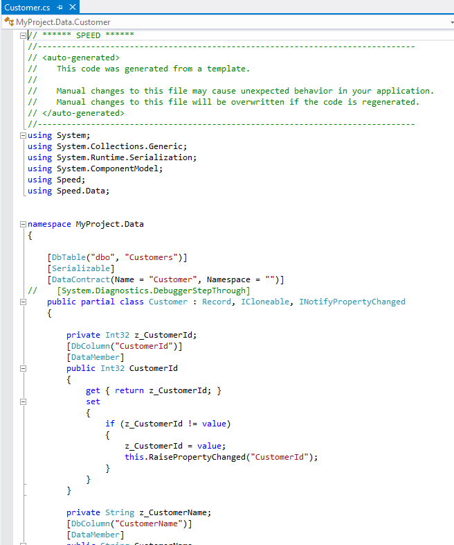

-   Classe **MyProject.Data\\Data\\Customer\\Customer.cs**  
    Classe de extensão da classe base. Repare no atributo “partial” na class

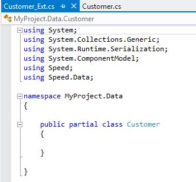

~~~~~~~~~~~~~~~~~~~~~~~~~~~~~~~~~~~~~~~~~~~~~~~~~~~~~~~~~~~~~~~~~~~~~~~~~~~~~~~~
    Vamos criar aqui uma propriedade para usar o Enum, assim poderemos
    fazer comparações usando o Enum em código ao invés de valores
    numéricos, como mostrado na figura abaixo, da mesma classe  
~~~~~~~~~~~~~~~~~~~~~~~~~~~~~~~~~~~~~~~~~~~~~~~~~~~~~~~~~~~~~~~~~~~~~~~~~~~~~~~~

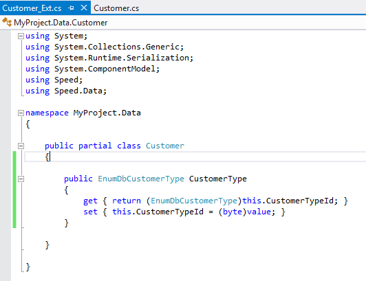

-   Classe **MyProject.Data\\BL\\Customer\\Base\\Customers.cs**  
    Classe base de negócios. Repare no atributo “partial” na class

-   \*\*IMPORTANTE: Repare que todo método possui como primeiro parâmetro  
    um objeto do tipo “Database”. Isto é para o programador ter o  
    “controle” da base de dados. Assim cabe a ele abrir uma connection  
    (usando db.BeginTransaction())” e chamar quantos métodos desejar\*\*

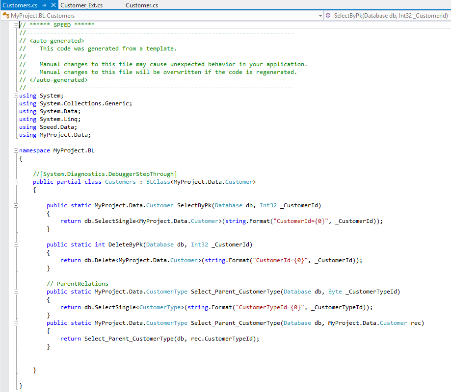

~~~~~~~~~~~~~~~~~~~~~~~~~~~~~~~~~~~~~~~~~~~~~~~~~~~~~~~~~~~~~~~~~~~~~~~~~~~~~~~~
    **Repare que são gerados métodos para retornar um registro pela PK e
    das tabelas filhas e pais relacionadas**  
    **Toda classe de negócios herda de BLClass, que possui vários
    métodos úteis que são compartilhados por todas as classes**  

-   Classe **MyProject.Data\\BL\\Customer\\Customers_Ext.cs**  
~~~~~~~~~~~~~~~~~~~~~~~~~~~~~~~~~~~~~~~~~~~~~~~~~~~~~~~~~~~~~~~~~~~~~~~~~~~~~~~~

Classe de extensão de negócios. Repare no atributo “partial” na class

~~~~~~~~~~~~~~~~~~~~~~~~~~~~~~~~~~~~~~~~~~~~~~~~~~~~~~~~~~~~~~~~~~~~~~~~~~~~~~~~
    

    -   Como exemplo, vamos um criar método para fazer um “like” pelo
nome do cliente  

        

        >     
>   repare que não se usa a palavra SQL “WHERE”. Coloque somente
        >   o que vai aparecer depois do “WHERE” no comando Sql.

    -   Configurando a aplicação “MyProject”  
~~~~~~~~~~~~~~~~~~~~~~~~~~~~~~~~~~~~~~~~~~~~~~~~~~~~~~~~~~~~~~~~~~~~~~~~~~~~~~~~

-   ConnectionString: Coloque no arquivo App.config, ou Web.config:

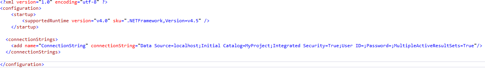

-   Usando a classe Sys (no namespace Speed.Data) para acessar o banco de dados.  
    A classe Sys possui propriedades e métodos para trabalhar com o banco de
    dados. Apenas que não é obrigatório o uso desta classe, mas facilita
    bastante. Numa aplicação “Windows Forms” podemos inicializa-la no método
    “Main” e numa aplicação “Web” pode ser no método “Application_Start” do
    Global.asx:

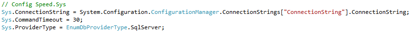

-   **Abrir uma connection com o banco Usando Sys:**

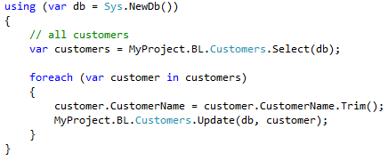

-   **Abrir uma connection com o banco sem uso da classe Sys**:

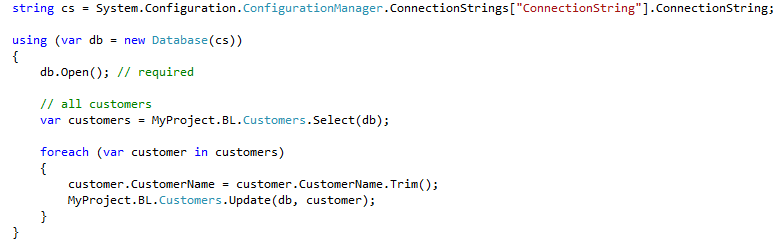

-   **Fazendo um Select sem usar a BL:**

    -   var customers = db.Select\<Customer\>();

        -   **Executando um comando no banco de dados:**

        -   db.ExecuteNonQuery("delete from Customers");

        -   **Usando o método ExecuteInt32:**

        -   int count = db.ExecuteInt32("select count(\*) from Customers");

    -   **Usando Transaction:**

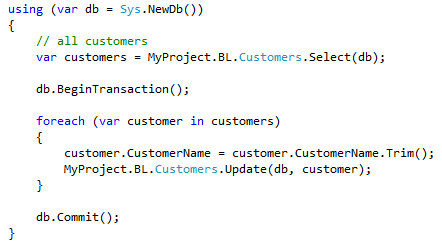

~~~~~~~~~~~~~~~~~~~~~~~~~~~~~~~~~~~~~~~~~~~~~~~~~~~~~~~~~~~~~~~~~~~~~~~~~~~~~~~~
    >     
>   **Repare que no final do bloco using existe o Commit. Se, ao
    >   sair do bloco using, não for aplicado um Commit, será dado um
    >   Rollback automaticamente**  
    >   
~~~~~~~~~~~~~~~~~~~~~~~~~~~~~~~~~~~~~~~~~~~~~~~~~~~~~~~~~~~~~~~~~~~~~~~~~~~~~~~~

-   **Retornando o valor de um campo “IDENTITY”:**

    -   O Speed pode ler o valor de um campo **IDENTITY** automaticamente. Por
        padrão ele não o faz, justamente considerando a performance. Se você não
        precisa carregar esse valor, para que o Speed fará isso?  
        Mas se precisar, nos método “Insert”, “ ou “Update”, passe o valor
        “EnumSaveMode.Requery” para o parâmetro “EnumSaveMode saveMode”

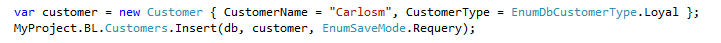

-   **Retornando um DataTable**

-   DataTable tb = db.ExecuteDataTable("select \\\* from Customers");

    -   A classe Database possui muitos outros métodos adicionais que são muito
        úteis no desenvolvimento de um sistema
