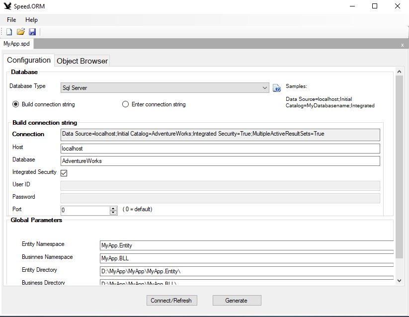
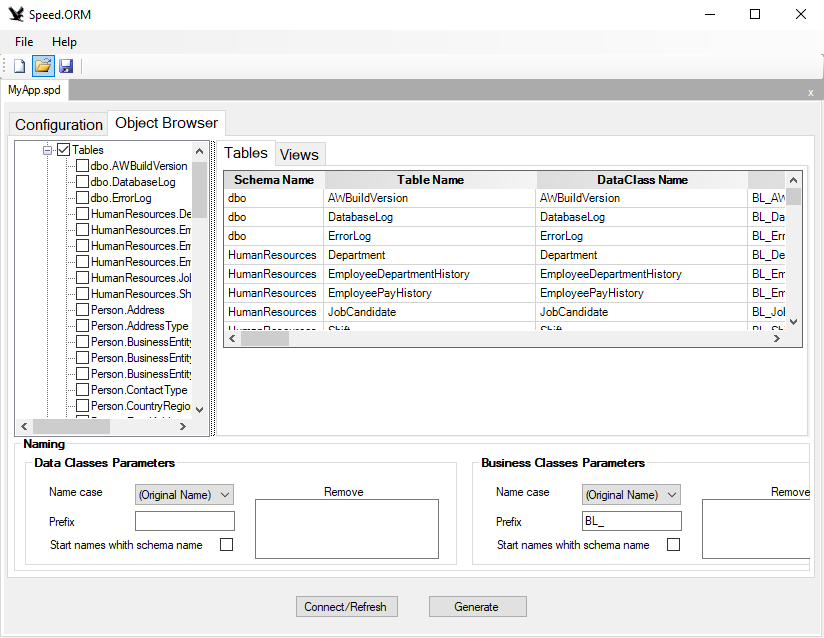

Speed.ORM - Born to be fast
===========================

 **O que é o Speed ORM?**

O Speed é uma plataforma de ORM desenvolvida para ser simples de utilizar e de
alta performance.

É composta de 3 grandes componentes

1.  **Programa Speed:** Este programa, um Windows Forms, permite conectar numa
    base de dados e gerar classes Entity e Bussiness num clique de um botão. Em
    poucos minutos você tem todo código gerado para fazer CRUD, de toda sua base
    de dados

2.  **Biblioteca Speed.Data:** A DLL Speed.Data faz a toda interface com a base
    de dados

3.  **Bibliotecas de Providers:** São DLLs específicas para cada base de dados.

    4.  Ex: Speed.Data.SqlServer.dll é utilizada para fazer a interface entre a base
        de dados e a classe Database

    2.  É muito simples criar uma interface para uma base base de dados ainda não
        suportada.

**Download do programa Speed (ClickOnce):**

<https://github.com/carlosast/Speed-ORM/raw/master/publish/setup.exe>

OBS: O Browser e o Windows emitirão alguns avisos pq é um executável que está
sendo baixado. Fique tranquilo que é apenas o programa de instalação do Speed
sendo baixado. Tentei fazer baixar o .application do clickonce mas não consegui
fazer funcionar no github. Se alguém tiver uma sugestão será benvinda.

Como usar
=========

Se não deseja perder tempo e ter classes para acessar toda sua base de dados em
poucos minutos clique no link abaixo para ter uma introdução rápida do uso:

<https://github.com/carlosast/Speed-ORM/blob/master/Resumo.md>

### Exemplo resumido de uso do código gerado:

 Depois das classes geradas, o uso é muito simples:

~~~~~~~~~~~~~~~~~~~~~~~~~~~~~~~~~~~~~~~~~~~~~~~~~~~~~~~~~~~~~~~~~~~~~~~~~~~~~~~~
// Inicializa os parâmetros defaults do Speed
Sys.ConnectionString = "............";
Sys.ProviderType = EnumDbProviderType.SqlServer;

// ====== SELECT ======
// Selecionar todos os regsistros
var recs = BL_Product.Select();

// Selecionar pela PK
var recs1 = BL_Product.SelectByPk(1);

// Selecionar produtos que contenham "Mountain" e MakeFlag seja true
var recsf = BL_Product.Select(new Product { Name = "Mountain" , MakeFlag = true}, EnumDbFilter.AndLike);

// Selecionar produtos por um filtro mais complexo
//     OBS: no where use os nomes das colunas da tabela e não o nome das propriedades
string where = "Name like '%Chainring%' and Color = 'Silver' and ReorderPoint > 100 order by Name";
var recsd = BL_Product.Select(where);

// ====== Update ======
var rec1 = BL_Product.SelectByPk(1);
recs1.ReorderPoint = 200;
// faz update e não recarrega a classe. É o default, para performance
BL_Product.Update(rec1);
// faz update e recarrega a classe.
BL_Product.Update(rec1, EnumSaveMode.Requery);

// ====== Insert ======
var reco = new Product
{
    // setar as propriedades
};
// faz insert e não recarrega a classe. É o default, para performance
BL_Product.Insert(rec1);
// faz insert e recarrega a classe.
BL_Product.Insert(rec1, EnumSaveMode.Requery);

// ====== Delete ======
// Deleta um registro
BL_Product.Delete(rec1);
// Exclui pela pk
BL_Product.DeleteByPk(100);

// ====== Transaction ======
using (var db = Sys.NewDb())
{
    db.BeginTransaction();
    // quando usar transações, sempre passe como primeiro parâmetro o objeto Database, senão o Speed abrirá outra conexão
    var rec2 = BL_Product.SelectByPk(db, 316);
    rec2.ReorderPoint = 200;
    BL_Product.Update(db, rec2);
    db.Commit();
}

// ====== Transaction com RunTran ======
Sys.RunInTran((db) => // se não der erro comita, se der erro dá rollback
{
    var rec2 = BL_Product.SelectByPk(db, 316);
    rec2.ReorderPoint = 200;
    BL_Product.Update(db, rec2);
});

// ====== Transaction com TransactionScope ======
using (var tr = new TransactionScope())
{
    var rec2 = BL_Product.SelectByPk(316);
    rec2.ReorderPoint = 200;
    BL_Product.Update(rec2);
}
        
~~~~~~~~~~~~~~~~~~~~~~~~~~~~~~~~~~~~~~~~~~~~~~~~~~~~~~~~~~~~~~~~~~~~~~~~~~~~~~~~

Introdução
==========

Speed.ORM foi desenvolvido com 3 pré-requisitos:

1.  Ser o mais rápido ORM no mundo .NET;

2.  Produtividade: gerar todo o código Sql, liberando o desenvolvedor para se
    focar no que interessa;

3.  Em alguns minutos, gera a camada de dados e a de negócios, automatizando 90%
    deste processo. Caberá ao desenvolvedor escrever alguns métodos na camada de
    negócios.

Não tem objetivo de ter todos recursos que alguns frameworks têm, tal como o
Entity Framework ou NHibernate, mas tem o objetivo de ser muito mais rápido e
usar muito menos memória

O Speed na tem objetivo em definir um padrão do arquitetura. As classes
estáticas permitem CRUD em toda a base de dados. Cabe ao desenvolvedor ou
arquiteto usar o Design Pattern que desejar e usar as classes geradas pelo Speed
para acesso à base de dados.

1 - História
============

 Trabalho como especialista em performance de aplicações e bancos de dados há
mais de 15 anos. Através das análises, detectei que um dos problemas era como
framework de ORM que estava sendo usado ou mesmo como foram desenvolvidas as
camadas de dados e de negócios, usando procedures e ADO.NET.

 Usando o Entity Framework como ORM, tente fazer um loop para inserir 10000000
de registros: ele usa vários gigabytes de memória, e se o computador não tiver
memória pra isso, vai travar. Além disso, apesar do Entity Framework possuir
vários recursos interessantes, tal como o LINQ TO SQL, não é adequado para um
sistema que precise ser rápido e escalável. O mesmo vale pra o NHibernate

 Por outro lado, há os puristas, que acreditam que todo o sistema, inclusive as
rotinas de CRUD, devam ser feitos com procedures. Que têm o discurso que é mais
rápido, e é assim que tem que ser feito. Não sou contra o uso de Stored
Procedures, mas sim no seu uso apenas quando é necessário. Por exemplo, tem
sentido trazer um volume enorme do banco de dados para o ORM para aplicar um
aumento de preços de 10% para 100000 produtos. Neste caso deve-se usar
procedure. Mas para fazer o CRUD básico isso não é necessário, devido os
seguintes fatores:

-   **Custo**: contabilize quantas horas são gastas para fazer as rotinas e
    procedures de CRUD pra uma banco de dados médio, de 300 tabelas por exemplo?
    Considerando que se gaste 15 minutos para fazer cada procedure de Insert,
    Select, Update e Delete, mais 15 minutos para a classe de DTO e mais 60
    minutos para a classe de business.

-   **Manutenção**: é muito comum, num desenvolvimento diário, o caso de se
    colocar uma coluna nova numa tabela. O desenvolvedor, devido ao prazo curto,
    acaba colocando na procedure de “Insert”, e não coloca na procedure de
    “Update”. Entre muitos outros casos que acontecem

-   **Lógica**: Vamos supor que, para salvar um registro na tabela de Customers,
    usando procedure demore 10ms, enquanto que usando ORM demore 12ms. Isto
    causa algum impacto na performance do sistema? O purista dirá que sim, mas
    se perguntar para quem vai pagar pelo software (que geralmente não sabe
    disso), com certeza responderá que não

-   **Portanto, sou a favor da seguinte filosofia:**

-   **A ORM o que é de ORM e a Procedure o que é de Procedure**

Espero que esta biblioteca possa ser útil à comunidade.

3 - Bancos de dados suportados:
===============================

-   Sql Server

-   Oracle

-   PostgreSQL

-   MySql

-   Firebird

-   SqlServerCe

Caso haja necessidade suportar outros bancos de dados, não demora mais que
algumas horas para fazer esta implementação

4 - Estrutura do Speed
======================

A biblioteca Speed é composta de 1 DLL principal "Speed.Data":

-   **Namespace Speed.Common** – Classes úteis. Por exemplo:

-   CollectionUtil: Classe com alguns métodos adicionais a IEnumerable e
    Dictionary

-   Conv: a classe mais usada em Speed. Possui métodos de conversões

-   Cryptography: Criptografia

-   DataTimer\<T\>: É uma classe de um cache simples, em memória. Um seu
    constructor se define uma function que carregará os valores, e um Timeout.
    Assim, pode ler o valor da propriedade Value. Se estourou o Timeout,
    DataTimer recarrega os valores, senão retorna o valor da memória Essa classe
    é muito boa pra se ter um "cache" local

-   CloneCompiler: Gera uma proxy compilado em memória para fazer clone de
    classes (properties e fields). Milhares de vezes mais rápido que reflection

-   etc.

-   **Namespace Speed. Data** – Classes de manipulação de dados e metadados para
    vários bancos de dados

-   **A classe principal do Speed.Data é a Database**, que encapsula uma
    connection para o banco de dados selecionado, e possui também vários métodos
    úteis de acesso de dados. Ex: ExecutaDataTable, ExecuteScalar, ExecuteInt32,
    etc.

-   A classe Database possui uma propriedade chamada “Provider”, que possui
    métodos de extração de metadados específico para cada banco de dados

Créditos
--------

### Criador

**Carlos Alberto Stefani**

Especialista em performance de Sistemas e Bancos de Dados gigantes

-   Contato: carlosast@msn.com

Colaboração
-----------

Quem desejar auxiliar no projeto Speed será bem-vindo.
