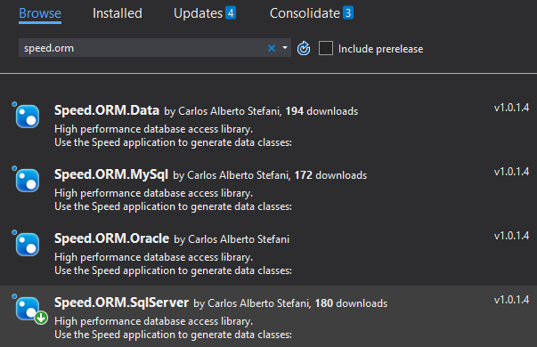

Como usar o Speed
=================

O programa Speed gera todo o código das classes de entidades e de negócios. Em
poucos minutos você terá mapeada todas tabelas e views de usa base de dados.

Baixe o programa Speed (ClickOnce):
===================================

<https://github.com/carlosast/Speed-ORM/raw/master/publish/setup.exe>

Baixar projeto exemplo: 
========================

<https://github.com/carlosast/Speed-ORM/blob/master/Docs/MyApp.zip?raw=true>

Clique no menu File/New para criar um novo projeto

Aba Configuration
=================

1 - Entre os parâmetros Tipo de Base de dados, de string de conexão, namespaces
de Entity e Bussiness Layer e os diretórios dos projetos

2 – Clique no botão “Conect/Refresh” para carregar a estrutura das tabelas e
views

Aba Object Browser
==================

3 – Selecione as tabelas e views que deseja gerar as classes

4 – Em “Naming” use as regras para o Speed nomes as classes

5 – Clique no botão “Generate” para gerar as classes dos objetos selcionados

Visual Studio
=============

6 – Clique na Solution com o botão direito do mouse e selecione “Manage Nuget
Packages for Solution”, Procure no nuget por “Speed.ORM” e instale em todos os
projetos o Package para a base de dados selecionada:

Oracle: <https://www.nuget.org/packages/Speed.ORM.Oracle/>

Sql Serer: <https://www.nuget.org/packages/Speed.ORM.SqlServer/>

NMySql: <https://www.nuget.org/packages/Speed.ORM.MySql/>

5 – Como usar?
==============

`class Program`

`{`

>   `static void Main(string[] args)`

>   `{`

>   **//** `====== `**Setar a conexão default do Speed** `======`

// Setando a conexão default, não será necessário passar uma Database para os
métodos do Speed que será aberta e fechada, automaticamente, uma Database

// Cada método da bussiness possui ao menos 2 sobrecargas; uma sem um parâmetro
database e outra com o parâmetro Database

>   `Sys.ConnectionString = "Data Source=localhost;Initial
>   Catalog=AdventureWorks;Integrated
>   Security=True;MultipleActiveResultSets=True";`

>   `Sys.ProviderType = EnumDbProviderType.SqlServer;`

>   `// ====== Abrir uma conexão ======`

using (var db = Sys.NewDb())

{

. . .

}

>   `// ====== SELECT ======`

>   `// Selecionar todos os regsistros`

>   `var recs = BL_Product.Select();`

>   `// Selecionar pela PK`

>   `var recs1 = BL_Product.SelectByPk(1);`

>   `// Selecionar produtos que contenham "Mountain" e MakeFlag seja true`

>   `var recsm = BL_Product.Select(new Product { Name = "Mountain", MakeFlag =
>   true }, EnumDbFilter.AndLike);`

>   `// Selecionar produtos por um filtro mais complexo`

>   `// OBS: no where uso os nomes das colunas da tabela e não o nome das
>   propriedades`

>   `string where = "Name like '%Chainring%' and Color = 'Silver' and
>   ReorderPoint \> 100 order by Name";`

>   `var recsd = BL_Product.Select(where);`

>   `// ====== Update ======`

>   `var rec1 = BL_Product.SelectByPk(1);`

>   `recs1.ReorderPoint = 200;`

>   `// faz update e não recarrega a classe. É o default, para performance`

>   `BL_Product.Update(rec1);`

>   `// faz update e recarrega a classe.`

>   `BL_Product.Update(rec1, EnumSaveMode.Requery);`

>   `// ====== Insert ======`

>   `var reco = new Product`

>   `{`

>   `// setar as propriedades`

>   `};`

>   `// faz insert e não recarrega a classe. É o default, para performance`

>   `BL_Product.Insert(rec1);`

>   `// faz insert e recarrega a classe.`

>   `BL_Product.Insert(rec1, EnumSaveMode.Requery);`

>   `// ====== Delete ======`

>   `// Deleta um registro`

>   `BL_Product.Delete(rec1);`

>   `// Exclui pela pk`

>   `BL_Product.DeleteByPk(100);`

>   `// ====== Transaction ======`

>   `using (var db = Sys.NewDb())`

>   `{`

>   `db.BeginTransaction();`

>   `// quando usar transações, sempre passe como primeiro parâmetro o objeto
>   Database, senão o Speed abrirá outra conexão`

>   `var rec2 = BL_Product.SelectByPk(db, 316);`

>   `rec2.ReorderPoint = 200;`

>   `BL_Product.Update(db, rec2);`

>   `db.Commit();`

>   `}`

>   `// ====== Transaction com RunInTran ======`

>   `Sys.RunInTran((db) => // se não der erro comita, se der erro dá rollback`

>   `{`

>   `var rec2 = BL_Product.SelectByPk(db, 316);`

>   `rec2.ReorderPoint = 200;`

>   `BL_Product.Update(db, rec2);`

>   `});`

>   `}`

}

`}`
